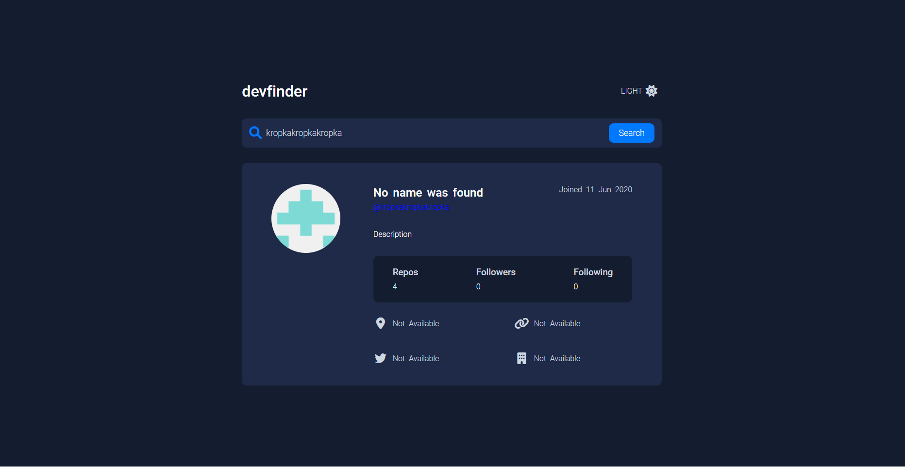

# Github User Search

This is a solution to the GitHub user search app challenge on Frontend Mentor. Frontend Mentor challenges help you improve your coding skills by building realistic projects.

### Built with

- Semantic HTML5 markup
- CSS custom properties
- Flexbox
- CSS Grid
- JavaScript

## Author

- Website - 
- Twitter - 

Todo:
- need to learn how to use localStorage for dakr/light mode
- clicking github handle should redirect to github page

